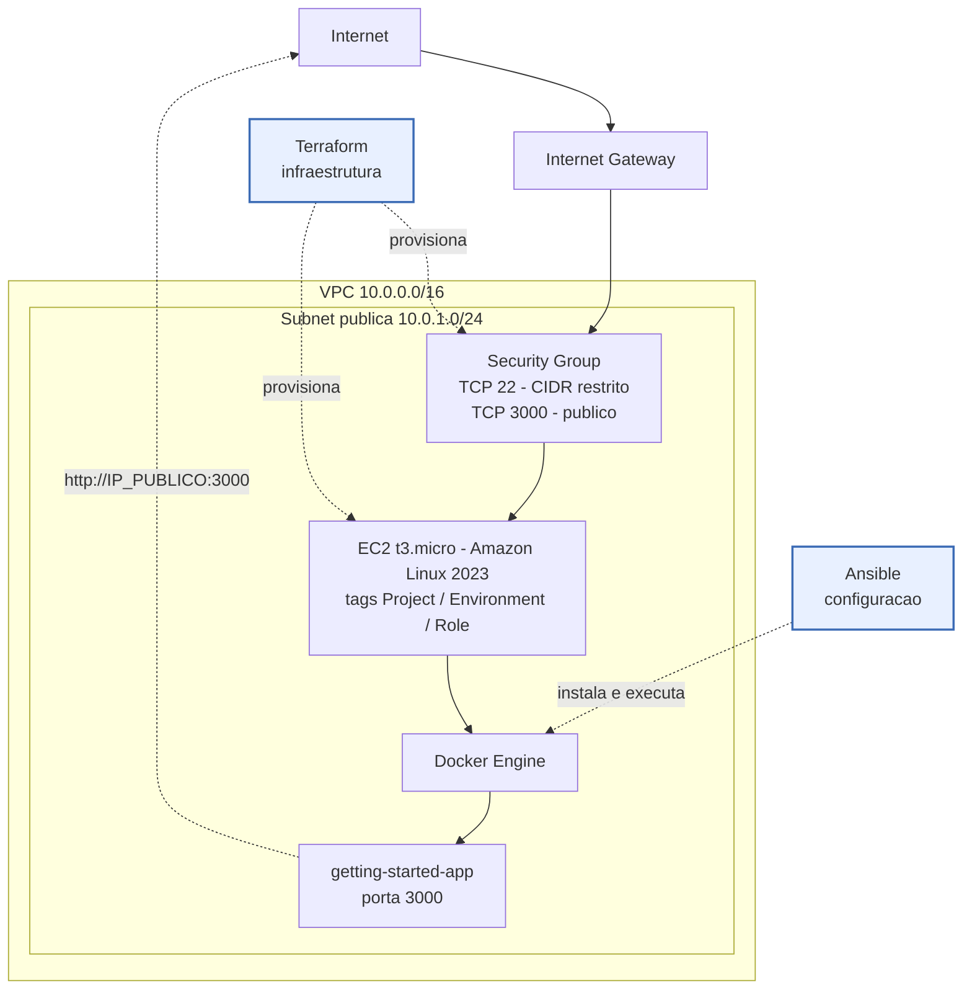
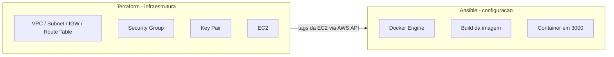
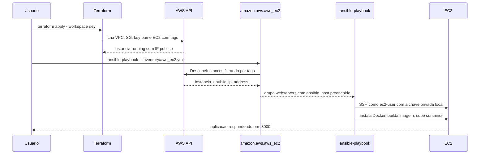

# Projeto Final — Terraform + Ansible

## Objetivo

Demonstrar, ponta a ponta, a integracao entre Terraform e Ansible em um fluxo real de infraestrutura como codigo:

```text
Terraform -> provisiona a infraestrutura AWS
Ansible   -> configura o que roda dentro dela
```

A separacao de responsabilidades e rigida e proposital:

- **Terraform** cuida apenas da infraestrutura AWS: VPC, subnet publica, internet gateway, route table, security group, key pair e instancia EC2.
- **Ansible** cuida apenas do que acontece dentro da instancia: instalacao do Docker Engine, build da imagem e execucao do container da aplicacao.

O Terraform nao instala nem configura software dentro da EC2. Nao existe `provisioner "remote-exec"`, nao existe `user_data` e nao existe nenhuma configuracao de sistema operacional no lado do Terraform.

A aplicacao implantada e a [getting-started-app](https://github.com/docker/getting-started-app), aplicacao oficial de exemplo do tutorial Getting Started do Docker, exposta na porta 3000.

## Reaproveitamento da atividade anterior

Toda a base Terraform deste projeto foi reaproveitada da Atividade 1 da disciplina:

- Repositorio de origem: https://github.com/jclebsonsilva/atividade1-terraform

O que veio da atividade anterior e foi mantido:

- estrutura de modulos `mod_network` e `mod_webserver`;
- backend remoto S3;
- separacao de ambientes por `terraform workspace`;
- scripts `deploy.sh` e `destroy.sh` como facilitadores;
- validacao que impede `0.0.0.0/0` no acesso SSH.

O que foi adaptado para o projeto final:

- chave propria no backend S3 (`terraform-states/projeto-terraform-ansible.tfstate`), isolando o state da atividade anterior;
- security group: removida a porta 80, adicionada a porta 3000;
- `user_data` removido por completo, deixando o Terraform restrito a infraestrutura;
- key pair passou a ser registrado via `aws_key_pair` a partir de uma chave publica local, sem depender de recurso criado manualmente na console AWS;
- tags padronizadas para permitir a descoberta pelo inventario dinamico do Ansible;
- Ansible migrado de inventario estatico com Nginx para inventario dinamico AWS com roles de Docker e da aplicacao.

## Arquitetura



O Terraform e o Ansible aparecem fora da VPC porque executam na maquina local ou no runner — nenhum dos dois roda dentro da AWS. O Terraform para na fronteira da instancia; o Ansible so atua de dentro dela para cima.

Fronteira entre as ferramentas:



## Tecnologias utilizadas

| Tecnologia | Uso no projeto |
| --- | --- |
| Terraform | Provisionamento da infraestrutura AWS |
| AWS Provider `~> 5.0` | Recursos EC2, VPC e correlatos |
| Backend S3 | State remoto com `use_lockfile` |
| Terraform Workspaces | Separacao dos ambientes `dev` e `prod` |
| Ansible | Configuracao da instancia |
| `amazon.aws` | Plugin de inventario dinamico `aws_ec2` |
| `community.docker` | Modulos `docker_image` e `docker_container` |
| Ansible Vault | Protecao de variavel sensivel simulada |
| Docker Engine | Runtime do container na EC2 |
| Amazon Linux 2023 | Sistema operacional da EC2 |

## Estrutura do repositorio

```text
.
├── terraform/
│   ├── main.tf                 backend, provider, locals, key pair e composicao dos modulos
│   ├── variables.tf            variaveis de entrada e validacao do CIDR de SSH
│   ├── outputs.tf              IP, DNS, instance id, tipo de instancia e workspace
│   └── modules/
│       ├── mod_network/        VPC, subnet, IGW, route table e security group
│       └── mod_webserver/      AMI Amazon Linux 2023 e instancia EC2
├── ansible/
│   ├── ansible.cfg
│   ├── requirements.yml        collections amazon.aws e community.docker
│   ├── inventory/
│   │   ├── aws_ec2.yml         inventario dinamico AWS
│   │   └── group_vars/all/
│   │       ├── vars.yml        variaveis compartilhadas, incluindo conexao SSH
│   │       └── vault.yml       variavel sensivel simulada, criptografada
│   ├── playbooks/
│   │   └── site.yml            orquestrador das roles
│   └── roles/
│       ├── docker/             instalacao e ativacao do Docker Engine
│       └── getting_started_app/ codigo, imagem e container da aplicacao
├── evidencias/                 prints de execucao
├── deploy.sh                   Terraform e, em seguida, Ansible
├── destroy.sh                  destruicao do workspace selecionado
├── .env.example
└── .gitignore
```

## Pre-requisitos

- Terraform instalado
- Ansible instalado
- `ssh-keygen` disponivel
- Credenciais AWS configuradas no ambiente
- Bucket S3 `bucket-tfstate-remote` acessivel na regiao `us-east-1`

Instale as collections Ansible do projeto:

```bash
ansible-galaxy collection install -r ansible/requirements.yml
```

## Credenciais AWS

As credenciais nunca ficam no repositorio. Use qualquer mecanismo padrao do AWS SDK:

```bash
# opcao 1 - perfil nomeado
export AWS_PROFILE=seu-perfil

# opcao 2 - variaveis de ambiente
export AWS_ACCESS_KEY_ID=...
export AWS_SECRET_ACCESS_KEY=...
export AWS_DEFAULT_REGION=us-east-1
```

As mesmas credenciais sao usadas pelo Terraform e pelo plugin de inventario dinamico do Ansible, que consulta a AWS API para descobrir a instancia.

Confirme antes de executar:

```bash
aws sts get-caller-identity
```

## Configuracao local

Crie o arquivo `.env` a partir do exemplo:

```bash
cp .env.example .env
```

Preencha as variaveis:

```bash
ENVIRONMENT=dev
PUBLIC_IP=SEU_IP_PUBLICO/32
ANSIBLE_VAULT_PASSWORD_FILE=.secrets/ansible-vault.pass
```

Descubra seu IP publico com:

```bash
curl -s https://checkip.amazonaws.com
```

Antes do primeiro deploy, crie o arquivo de senha do Vault no caminho configurado:

```bash
mkdir -p .secrets
printf 'sua-senha-do-vault\n' > .secrets/ansible-vault.pass
chmod 600 .secrets/ansible-vault.pass
```

Ao executar `./deploy.sh`, o projeto gera ou reutiliza a chave ED25519 em `.secrets/ssh/<environment>`. Somente a chave publica e enviada ao Terraform/AWS. A chave privada permanece exclusivamente na sua maquina, fora do Terraform state e fora dos arquivos versionados.

## Terraform Workspaces

Os ambientes sao separados por workspace, cada um com seu proprio state dentro do mesmo backend S3:

```bash
terraform -chdir=terraform workspace list
terraform -chdir=terraform workspace new dev
terraform -chdir=terraform workspace new prod
terraform -chdir=terraform workspace select dev
```

| Workspace | Tipo de instancia | Prefixo dos recursos |
| --- | --- | --- |
| `dev` | `t3.micro` | `projeto-terraform-ansible-dev-` |
| `prod` | `t3.micro` | `projeto-terraform-ansible-prod-` |

O workspace e a origem de tudo: define `local.environment`, o prefixo de nome de todos os recursos, a tag `Environment` da EC2, o filtro do inventario dinamico e o nome do par de chaves SSH local. Os scripts selecionam o workspace automaticamente a partir de `ENVIRONMENT`.

## Provisionamento da infraestrutura

Recursos criados pelo Terraform:

- VPC `10.0.0.0/16` com DNS support e DNS hostnames habilitados
- Subnet publica `10.0.1.0/24` com `map_public_ip_on_launch`
- Internet Gateway e route table publica com rota `0.0.0.0/0`
- Security Group com TCP/22 restrito ao CIDR informado e TCP/3000 publico
- `aws_key_pair` a partir da chave publica local
- EC2 `t3.micro` com Amazon Linux 2023, IP publico e IMDSv2 obrigatorio

Outputs disponiveis:

```text
environment
webserver_instance_type
webserver_instance_id
webserver_public_ip
webserver_public_dns
webserver_ssh_user
key_pair_name
```

## Integracao Terraform -> Ansible

### Estrategia escolhida

Foi adotada a **Opcao A — inventario dinamico AWS**.

Nao existe `null_resource`, nao existe `local-exec` e nao existe arquivo de inventario estatico gerado por script. O `deploy.sh` e apenas um wrapper de conveniencia que executa o Terraform e, depois, o `ansible-playbook`. A descoberta da instancia e feita inteiramente pelo plugin `amazon.aws.aws_ec2` consultando a AWS API.

Motivo da escolha: mantem a fronteira entre as ferramentas totalmente limpa. O Terraform nao precisa saber que o Ansible existe, e o Ansible nao depende de nenhum output do Terraform. Cada ferramenta pode ser executada isoladamente.

### Como a descoberta funciona



O contrato entre as duas fases sao as **tags da EC2**. O Terraform grava as tags; o inventario filtra por elas. Nenhum IP e passado de uma ferramenta para a outra.

### Tags utilizadas

Aplicadas pelo Terraform em `terraform/main.tf`:

| Tag | Valor | Papel na descoberta |
| --- | --- | --- |
| `Project` | `projeto-terraform-ansible` | Isola o projeto de outras EC2 da conta |
| `Environment` | `terraform.workspace` | Separa `dev` de `prod` |
| `Role` | `webserver` | Define o grupo `webservers` no inventario |
| `ManagedBy` | `terraform` | Rastreabilidade |
| `Course` | `DevOps 2025.2` | Rastreabilidade |
| `Name` | `projeto-terraform-ansible-<env>-webserver` | Nome do host no inventario |

Filtro correspondente em `ansible/inventory/aws_ec2.yml`:

```yaml
filters:
  tag:Project: projeto-terraform-ansible
  tag:Environment: "{{ lookup('env', 'ENVIRONMENT') }}"
  tag:Role: webserver
  instance-state-name: running
```

A combinacao das tres tags mais o estado `running` torna a selecao inequivoca: nenhuma EC2 de outro projeto, de outro ambiente ou ja encerrada pode ser capturada.

> A variavel de ambiente `ENVIRONMENT` precisa estar exportada ao rodar o Ansible manualmente. Sem ela, o filtro `tag:Environment` fica vazio e o inventario retorna zero hosts. O `deploy.sh` exporta automaticamente.

### Ordem de execucao

O `deploy.sh` executa nesta ordem:

1. Carrega o `.env` e valida `ENVIRONMENT` e `PUBLIC_IP`
2. Localiza o arquivo de senha do Vault
3. Gera ou reutiliza a chave SSH ED25519 do ambiente
4. Bloqueia a execucao se o CIDR de SSH for `0.0.0.0/0`
5. Exporta `TF_VAR_ssh_allowed_cidr_block` e `TF_VAR_ssh_public_key`
6. `terraform init`
7. Seleciona ou cria o workspace correspondente a `ENVIRONMENT`
8. `terraform fmt -check -recursive`, `terraform validate`, `terraform plan` e `terraform apply`
9. Le os outputs de IP e DNS
10. Valida o inventario dinamico com `ansible-inventory --graph`
11. Confirma que o grupo `webservers` tem pelo menos um host, abortando se estiver vazio
12. Executa `ansible-playbook` com o arquivo de senha do Vault
13. Exibe IP publico, DNS publico e a URL final da aplicacao

## Configuracao com Ansible

O playbook `ansible/playbooks/site.yml` e apenas um orquestrador:

```yaml
- name: Preparar instancia provisionada pelo Terraform
  hosts: webservers
  become: true
  gather_facts: false

  pre_tasks:
    - name: Aguardar disponibilidade SSH da instancia
      ansible.builtin.wait_for_connection:
        timeout: 300

    - name: Coletar fatos da instancia
      ansible.builtin.setup:

  roles:
    - role: docker
    - role: getting_started_app
```

`gather_facts: false` com `wait_for_connection` explicito e proposital: a EC2 recem-criada normalmente ainda nao aceita SSH quando o playbook comeca, e a coleta de fatos padrao falharia antes da espera.

### Role `docker`

Responsavel por deixar o Docker Engine operacional antes da role da aplicacao:

- instala `docker` e `python3-requests` com `ansible.builtin.dnf`;
- garante o servico `docker` iniciado e habilitado no boot com `ansible.builtin.service`.

`python3-requests` e a dependencia Python exigida pelos modulos da collection `community.docker` na versao utilizada.

Nenhum `shell` ou `command` e usado.

### Role `getting_started_app`

Responsavel pela aplicacao, usando exclusivamente modulos idempotentes:

| Task | Modulo |
| --- | --- |
| Instalar Git | `ansible.builtin.dnf` |
| Garantir diretorio `/opt/getting-started-app` | `ansible.builtin.file` |
| Clonar o repositorio oficial da aplicacao | `ansible.builtin.git` |
| Publicar o Dockerfile | `ansible.builtin.template` |
| Construir a imagem | `community.docker.docker_image` |
| Executar o container | `community.docker.docker_container` |

O repositorio oficial `docker/getting-started-app` nao inclui um Dockerfile — cria-lo faz parte do tutorial. Por isso a role renderiza um `Dockerfile.j2` proprio, baseado em `node:24-alpine`, antes do build.

O container sobe com:

```text
nome:    getting-started-app
portas:  3000:3000
estado:  started
restart: unless-stopped
```

Nenhum `docker build` ou `docker run` e executado via `shell`/`command`.

## Ansible Vault

O projeto versiona uma variavel sensivel simulada em `ansible/inventory/group_vars/all/vault.yml`, criptografada com Ansible Vault:

```yaml
vault_app_admin_password: "senha-simulada"
```

A senha do Vault nao fica no repositorio. Ela e lida de um arquivo local ignorado pelo Git, indicado por `ANSIBLE_VAULT_PASSWORD_FILE`, com fallback automatico para `.secrets/ansible-vault.pass`.

Como o `vault.yml` esta dentro do `group_vars` do inventario, ele e efetivamente carregado em toda execucao do playbook. Rodar sem a senha falha com:

```text
[ERROR]: Attempting to decrypt but no vault secrets found.
```

Isso serve como prova de que o Vault esta realmente em uso no fluxo, e nao apenas presente no repositorio.

Para gerar uma nova senha local do Vault e recriar o arquivo criptografado:

```bash
mkdir -p .secrets
printf 'sua-nova-senha-do-vault\n' > .secrets/ansible-vault.pass
chmod 600 .secrets/ansible-vault.pass

ansible-vault create \
  --vault-password-file .secrets/ansible-vault.pass \
  ansible/inventory/group_vars/all/vault.yml
```

> A ordem importa: grave o arquivo de senha **antes** de criptografar. Regravar `.secrets/ansible-vault.pass` depois de ja ter criptografado o `vault.yml` torna o arquivo permanentemente ilegivel, com o erro `Decryption failed (no vault secrets were found that could decrypt)`.

Para alterar um arquivo ja existente:

```bash
ansible-vault edit \
  --vault-password-file .secrets/ansible-vault.pass \
  ansible/inventory/group_vars/all/vault.yml
```

## Como executar

### Caminho curto — scripts

```bash
./deploy.sh
```

Sobrescrevendo o ambiente sem editar o `.env`:

```bash
ENVIRONMENT=prod ./deploy.sh
```

### Caminho detalhado — comandos diretos

O `deploy.sh` nao esconde nenhuma mecanica. Os passos equivalentes sao:

```bash
# 1. variaveis de ambiente
export ENVIRONMENT=dev
export SSH_PRIVATE_KEY_FILE="$PWD/.secrets/ssh/dev"
export TF_VAR_ssh_allowed_cidr_block="$(curl -s https://checkip.amazonaws.com)/32"
export TF_VAR_ssh_public_key="$(cat .secrets/ssh/dev.pub)"

# 2. Terraform
terraform -chdir=terraform init
terraform -chdir=terraform workspace select dev
terraform -chdir=terraform fmt -check -recursive
terraform -chdir=terraform validate
terraform -chdir=terraform plan
terraform -chdir=terraform apply

# 3. conferir a descoberta pelo inventario dinamico
export ANSIBLE_CONFIG="$PWD/ansible/ansible.cfg"
ansible-inventory -i ansible/inventory/aws_ec2.yml --graph
ansible-inventory -i ansible/inventory/aws_ec2.yml --list

# 4. Ansible
ansible-playbook \
  -i ansible/inventory/aws_ec2.yml \
  ansible/playbooks/site.yml \
  --vault-password-file .secrets/ansible-vault.pass
```

Se preferir digitar a senha do Vault em vez de usar arquivo, troque a ultima flag por `--ask-vault-pass`.

## Como validar a aplicacao

Descubra o endereco publico:

```bash
terraform -chdir=terraform output webserver_public_ip
terraform -chdir=terraform output webserver_public_dns
```

Teste de conectividade do Ansible:

```bash
ansible -i ansible/inventory/aws_ec2.yml webservers -m ping
```

Teste da aplicacao:

```bash
curl http://<PUBLIC_IP>:3000
```

Ou pelo navegador:

```text
http://<PUBLIC_IP>:3000
```

> `ping` para o IP publico **nao responde**, e isso e esperado. O security group libera apenas TCP/22 e TCP/3000, sem regra ICMP. Para testar alcance de rede use `nc -vz <PUBLIC_IP> 3000`.

## Teste de idempotencia

Sem alterar codigo ou infraestrutura, execute novamente.

Terraform:

```bash
terraform -chdir=terraform apply
```

Resultado esperado:

```text
No changes. Your infrastructure matches the configuration.
```

Ansible:

```bash
ansible-playbook \
  -i ansible/inventory/aws_ec2.yml \
  ansible/playbooks/site.yml \
  --vault-password-file .secrets/ansible-vault.pass
```

Resultado esperado no PLAY RECAP:

```text
changed=0    unreachable=0    failed=0
```

A idempotencia vem do uso exclusivo de modulos declarativos: `dnf` e `service` nao reinstalam nem reiniciam o que ja esta no estado desejado, `docker_image` com `state: present` nao reconstroi uma imagem existente, e `docker_container` com `state: started` nao recria um container que ja esta rodando com a mesma configuracao.

## Como destruir os recursos

```bash
./destroy.sh
```

Ou explicitamente por workspace:

```bash
ENVIRONMENT=prod ./destroy.sh
```

Equivalente direto:

```bash
terraform -chdir=terraform workspace select dev
terraform -chdir=terraform destroy
```

O `destroy.sh` imprime o ambiente e o workspace antes de destruir, e aborta se o workspace informado nao existir, evitando destruir o ambiente errado.

## Evidencias

Os arquivos estao em [`evidencias/`](evidencias/).

| Evidencia | Arquivo | O que comprova |
| --- | --- | --- |
| Aplicacao no navegador | [`evidencias/image_1.png`](evidencias/image_1.png) | `getting-started-app` respondendo em `ec2-34-239-176-161.compute-1.amazonaws.com:3000` |
| Ansible + `curl` | [`evidencias/image_2.png`](evidencias/image_2.png) | PLAY RECAP com `ok=10 changed=8 unreachable=0 failed=0` no host `projeto-terraform-ansible-dev-webserver`, seguido do HTML retornado por `curl` na porta 3000 |
| Destruicao dos recursos | [`evidencias/image_3.png`](evidencias/image_3.png) | `terraform destroy` no workspace `prod` removendo os 8 recursos, com `Destroy complete! Resources: 8 destroyed.` |

Execucao registrada no ambiente `dev`:

```text
PLAY RECAP ****************************************************************
projeto-terraform-ansible-dev-webserver : ok=10 changed=8 unreachable=0 failed=0

Deploy concluido com sucesso.
Public IP: 34.239.176.161
Public DNS: ec2-34-239-176-161.compute-1.amazonaws.com
Application URL: http://34.239.176.161:3000
```

Destruicao registrada no ambiente `prod`:

```text
Plan: 0 to add, 0 to change, 8 to destroy.

Destroy complete! Resources: 8 destroyed.
```

Ainda falta registrar a evidencia de idempotencia descrita na secao [Teste de idempotencia](#teste-de-idempotencia): o `terraform apply` retornando `No changes` e o `ansible-playbook` retornando `changed=0`.

## Consideracoes de seguranca

- **SSH nunca fica aberto para o mundo.** `0.0.0.0/0` e bloqueado em dois pontos independentes: uma guarda em `deploy.sh`/`destroy.sh` e um bloco `validation` em `terraform/variables.tf`.
- **A chave privada SSH nunca entra na AWS nem no Terraform state.** O par ED25519 e gerado localmente e apenas o conteudo publico e passado ao Terraform via `TF_VAR_ssh_public_key`.
- **Nenhum segredo versionado.** `.env`, `.secrets/` e arquivos `*.pem` estao no `.gitignore`. O `.env.example` contem apenas placeholders.
- **Credenciais AWS nunca ficam no codigo.** Sao lidas do ambiente pelo SDK.
- **State fora do repositorio.** O `.tfstate` fica no backend S3 remoto com `use_lockfile` habilitado; arquivos de state e planos locais estao no `.gitignore`.
- **IMDSv2 obrigatorio** na EC2 (`http_tokens = "required"`), mitigando SSRF contra o metadata service.
- **Superficie de rede minima.** Apenas TCP/22 restrito ao CIDR do operador e TCP/3000 para a aplicacao. Sem ICMP e sem porta 80.
